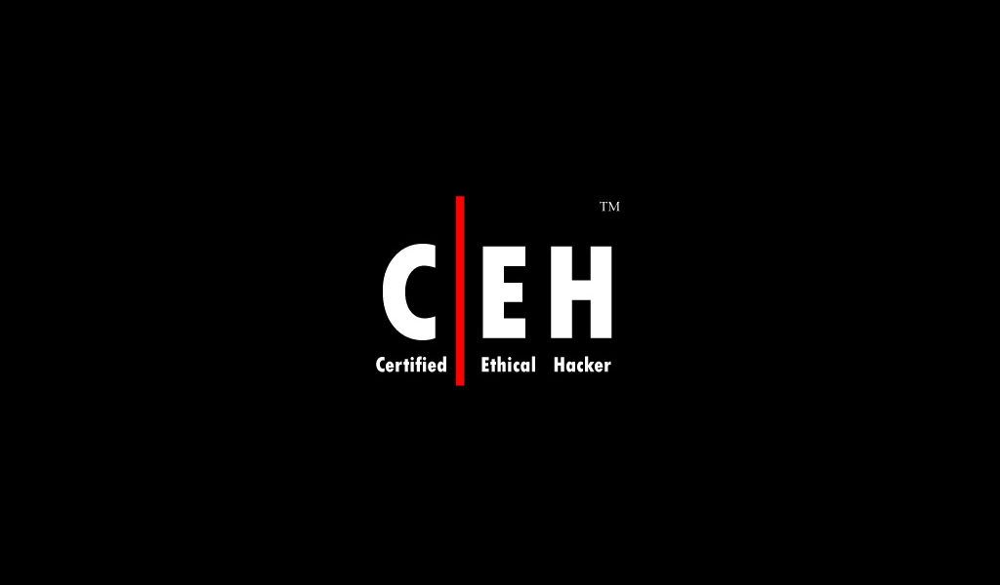

# CEH (Maktabkhooneh)

## MyScore : 91.3/100

I've Uploaded My soloutions to the questions and Quizzes. taught by Jadi

## Contents

- Quizzes
- Practical Quizzes

## Certificate

- [Verified Certificate](https://www.linkedin.com/in/mohammadmahdijavid/)

## References

- [[1] CEH - Jadi](https://maktabkhooneh.org/course/%D8%A2%D9%85%D9%88%D8%B2%D8%B4-%D9%87%DA%A9-%D9%82%D8%A7%D9%86%D9%88%D9%86%D9%85%D9%86%D8%AF-CEH-mk641/)

## Contributing

Please refer to each project's style and contribution guidelines for submitting patches and additions. In general, we follow the "fork-and-pull" Git workflow.

1. **Fork** the repo on GitHub
2. **Clone** the project to your own machine
3. **Commit** changes to your own branch
4. **Push** your work back up to your fork
5. Submit a **Pull request** so that we can review your changes

NOTE: Be sure to merge the latest from "upstream" before making a pull request!

## Contact

- [[1] LinkedIn](https://www.linkedin.com/in/mohammadmahdijavid/)

- [[2] My Personal Website](http://mohammadmahdijavid.ir/)

## Thanks For Reading

_If you find these useful, make sure to star:star: the repo to let me know you appreciate it :)_

_All the best throughout your journey to the certification!_

## License

MIT © [MohammadMahdi Javid](https://github.com/mohammadmahdijavid)

## KeyWords

- CEH
- Jadi
- maktabkhooneh
- MohammadMahdi Javid
- آموزش هک قانونمند (CEH)
